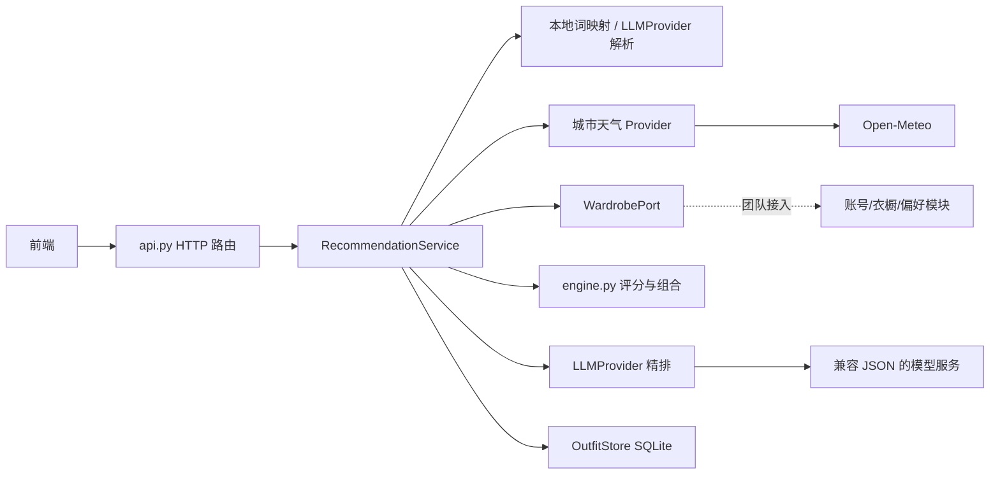
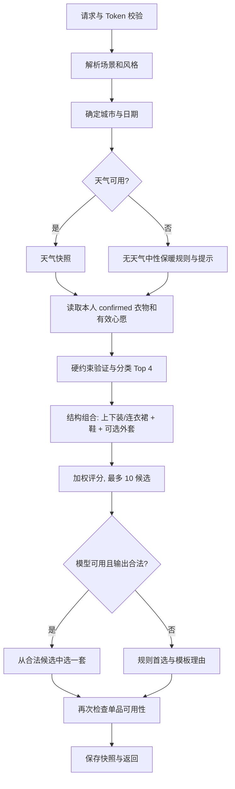
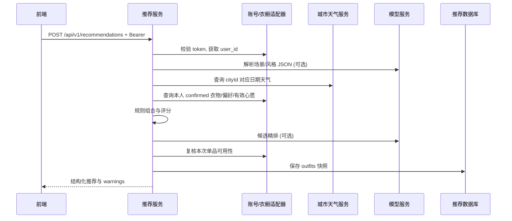
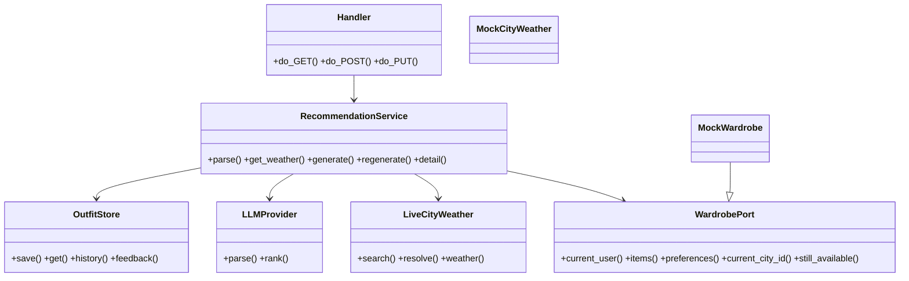

# 推荐模块设计

## 架构

```mermaid
flowchart LR
  Client[前端] --> API[api.py HTTP 路由]
  API --> Service[RecommendationService]
  Service --> Parser[本地词映射 / LLMProvider 解析]
  Service --> Weather[城市天气 Provider]
  Service --> Wardrobe[WardrobePort]
  Service --> Engine[engine.py 评分与组合]
  Service --> Ranker[LLMProvider 精排]
  Service --> Store[OutfitStore SQLite]
  Wardrobe -.团队接入.-> Accounts[账号/衣橱/偏好模块]
  Weather --> ExternalWeather[Open-Meteo]
  Ranker --> ExternalAI[兼容 JSON 的模型服务]
```

## 算法流程

```mermaid
flowchart TD
  A[请求与 Token 校验] --> B[解析场景和风格]
  B --> C[确定城市与日期]
  C --> D{天气可用?}
  D -- 是 --> E[天气快照]
  D -- 否 --> F[无天气中性保暖规则与提示]
  E --> G[读取本人 confirmed 衣物和有效心愿]
  F --> G
  G --> H[硬约束验证与分类 Top 4]
  H --> I[结构组合: 上下装/连衣裙 + 鞋 + 可选外套]
  I --> J[加权评分, 最多 10 候选]
  J --> K{模型可用且输出合法?}
  K -- 是 --> L[从合法候选中选一套]
  K -- 否 --> M[规则首选与模板理由]
  L --> N[再次检查单品可用性]
  M --> N
  N --> O[保存快照与返回]
```

## 时序

```mermaid
sequenceDiagram
  participant F as 前端
  participant R as 推荐服务
  participant W as 账号/衣橱适配器
  participant C as 城市天气服务
  participant A as 模型服务
  participant D as 推荐数据库
  F->>R: POST /api/v1/recommendations + Bearer
  R->>W: 校验 token, 获取 user_id
  R->>A: 解析场景/风格 JSON (可选)
  R->>C: 查询 cityId 对应日期天气
  R->>W: 查询本人 confirmed 衣物/偏好/有效心愿
  R->>R: 规则组合与评分
  R->>A: 候选精排 (可选)
  R->>W: 复核本次单品可用性
  R->>D: 保存 outfits 快照
  R-->>F: 结构化推荐与 warnings
```

## 类依赖

```mermaid
classDiagram
  class Handler {+do_GET() +do_POST() +do_PUT()}
  class RecommendationService {+parse() +get_weather() +generate() +regenerate() +detail()}
  class WardrobePort {+current_user() +items() +preferences() +current_city_id() +still_available()}
  class MockWardrobe
  class LiveCityWeather {+search() +resolve() +weather()}
  class MockCityWeather
  class LLMProvider {+parse() +rank()}
  class OutfitStore {+save() +get() +history() +feedback()}
  Handler --> RecommendationService
  RecommendationService --> WardrobePort
  RecommendationService --> LiveCityWeather
  RecommendationService --> LLMProvider
  RecommendationService --> OutfitStore
  MockWardrobe --|> WardrobePort
```

评分权重在 `config.py`，默认天气 0.25、场合 0.15、风格 0.16、颜色 0.12、偏好 0.12、实用性 0.12、完整性 0.08。评分只排序，身份、可用性、确认状态与锁定项均为硬约束。反馈采用最近 30 条喜欢/不喜欢的解析色系做轻量加减分，没有模型训练。
